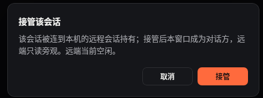
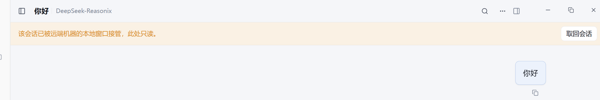
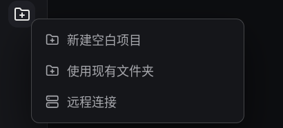
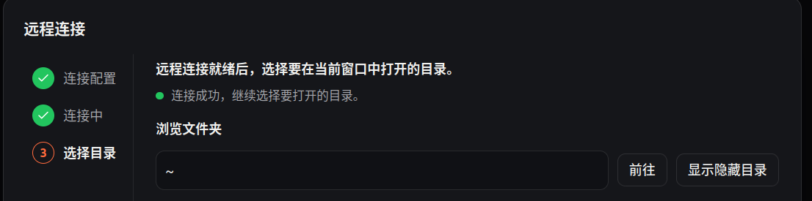
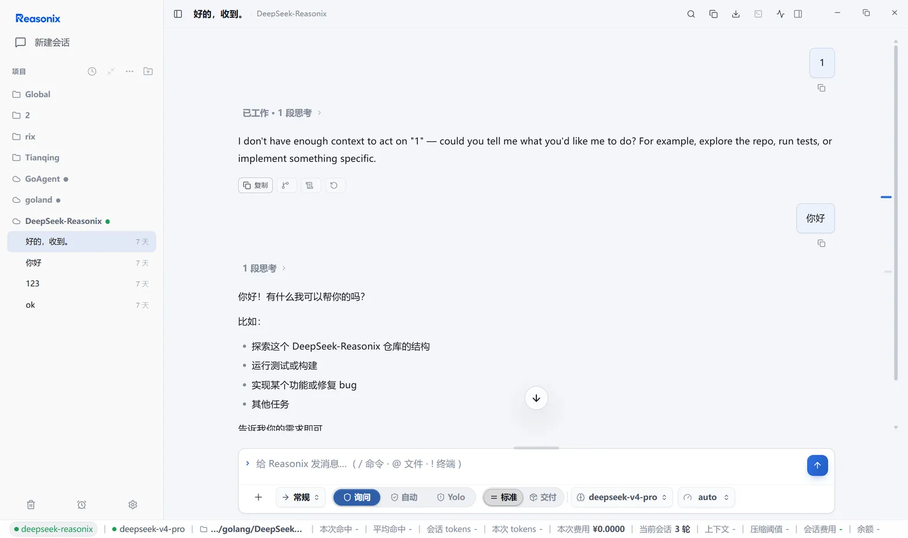

# Remote sessions

<a href="../README.md">README</a>
&nbsp;·&nbsp;
<a href="./REMOTE_SESSIONS.zh-CN.md">简体中文</a>
&nbsp;·&nbsp;
<a href="./GUIDE.md">General guide</a>

The remote module (Remote SSH) runs Reasonix on a remote host and reaches it
over your own SSH connection — VS Code Remote-SSH style. This document
describes the whole system: what runs where, host configuration, the CLI, the
remote serve process, the session lifecycle, the desktop surface, credential
modes, and troubleshooting.

The screenshots in this guide use the Simplified Chinese desktop UI; the
controls and states are the same in other locales.

## Contents

- [What the remote module does](#what-the-remote-module-does)
- [What runs where](#what-runs-where)
- [Hosts and configuration](#hosts-and-configuration)
- [Connecting from the CLI](#connecting-from-the-cli)
- [The remote serve process](#the-remote-serve-process)
- [Remote session lifecycle](#remote-session-lifecycle)
- [Desktop remote work](#desktop-remote-work)
- [Credentials and model access](#credentials-and-model-access)
- [Connection behavior and failures](#connection-behavior-and-failures)
- [Troubleshooting](#troubleshooting)
- [Command reference](#command-reference)

## What the remote module does

Reasonix bootstraps a persistent headless `reasonix serve` on the remote host,
forwards a local loopback port to it over the SSH tunnel, and then opens the
serve web client or an in-app remote session tab through that tunnel. The
agent, its tools, and its files all live on the remote host at full fidelity;
nothing runs through a lossy file proxy.

- V1 remote hosts must be Linux or macOS. The local CLI and desktop also run
  on Windows, but V1 Windows authentication does not support the OpenSSH
  named-pipe agent; use an identity file or password instead.
- There is no local background daemon: the CLI's `connect` is a foreground
  supervisor, and the desktop holds its own tunnel.
- Disconnecting the local side never touches the remote serve — it keeps
  running and the next connection reuses it.

## What runs where

```
Local side                                Remote host
──────────                                ──────────
reasonix remote … (CLI)                   ~/.reasonix/remote/
desktop app / separate web window         serve-<slug>.{json,token,port,pid,log}
        │                                          │
        ▼                                          ▼
supervised SSH connection ─── SSH tunnel ─── headless reasonix serve
(keepalive, backoff reconnect,              binds remote 127.0.0.1:0, HTTP + SSE
 TOFU host keys, SFTP)                      agent / tools / files all remote
        │
        ▼  local loopback -L forward
serve web UI in a browser, or the in-app remote session tab
```

- **Local frontends**: the `reasonix remote …` CLI; the desktop app (Electron);
  and serve's own web client (opened in a browser or hosted by the separate
  web-window child process).
- **Transport kernel**: one supervised SSH connection — dial, host-key
  verification, attaching port forwards, keepalive, and backoff reconnect
  after a drop. The CLI and the desktop share the same kernel; interactive
  moments (TOFU confirmation, password/passphrase prompts) surface through
  callbacks to whichever frontend is driving.
- **Remote side**: a headless `reasonix serve` bound only to the remote
  loopback address; port, auth token, and pid are handed over through files,
  never exposed on the remote network.
- **Data plane**: sessions, tool execution, and file operations all happen on
  the remote host; the local side only forwards and renders. Remote file
  browsing and editing go over SFTP, not through serve.

## Hosts and configuration

Hosts live in the user-global `[remote]` section of `config.toml`. Like
`[secrets]`, a project `reasonix.toml` cannot inject or override remote hosts
— a cloned repo can never steer where Reasonix opens SSH connections.

```toml
[remote]
[[remote.hosts]]
name            = "gpu-box"
host            = "203.0.113.7"
user            = "dev"
identity_file   = "~/.ssh/id_ed25519"
workspace       = "~/projects/app"
serve_install   = "auto"            # auto | npm | upload | never
credential_mode = "remote"          # remote | local-proxy

[[remote.hosts.forwards]]
type   = "local"                    # local (-L) | remote (-R)
bind   = "127.0.0.1:5432"
target = "127.0.0.1:5432"
```

### Host fields

| Field | Meaning |
| --- | --- |
| `name` | Host name; CLI subcommands refer to it |
| `host` / `port` / `user` | Address and login user; port defaults to 22, user to the current user |
| `identity_file` | Path to a private key. Only the path is stored; key material is never stored |
| `passphrase_env` / `password_env` | Env var names holding the passphrase/password; values live in Reasonix's global `.env` |
| `proxy_jump` | Jump chain, OpenSSH `ProxyJump` syntax |
| `workspace` | Default remote workspace |
| `serve_install` | Remote CLI install strategy: `auto` \| `npm` \| `upload` \| `never` |
| `credential_mode` | `remote` (key on the remote host) \| `local-proxy` (desktop holds the key); default `remote` |
| `use_ssh_config` | Layer unset fields from `~/.ssh/config` |

`[[remote.hosts.forwards]]` persists port forwards with the host. `type`
selects `local` (`-L`) or `remote` (`-R`). For `-L`, `bind` listens locally
and `target` is dialed from the remote host; for `-R`, `bind` listens on the
remote host and `target` is dialed locally.

`[[remote.projects]]` pins remote workspaces into the desktop project tree:
`host_id` + `workspace` + `title`.

### Credential slots

When the desktop host form receives a plaintext password or key passphrase,
Reasonix stores it in a generated `REASONIX_REMOTE_<hash>_PASSWORD` /
`REASONIX_REMOTE_<hash>_KEY_PASSPHRASE` slot in the global `.env` (atomic
write with rollback on failure) and writes only the slot name to
`config.toml`. Leaving the plaintext field empty preserves the current
reference and does not create a slot. Deleting or clearing the host
garbage-collects unused generated slots; env var names you configured
yourself are never deleted.

### Host resolution precedence

1. Fields set explicitly in `[remote]`;
2. the local `ssh -G` resolution (authoritative; covers `Include`, wildcard
   `Host`, `Match` (including `Match exec`), repeated `IdentityFile`,
   `ProxyJump`, and `IdentitiesOnly`);
3. the built-in `~/.ssh/config` parser;
4. defaults (port 22, current user).

`reasonix remote import` stores the original alias with
`use_ssh_config = true` instead of copying a snapshot that goes stale.

## Connecting from the CLI

### Host management

```bash
reasonix remote add gpu-box dev@203.0.113.7 --workspace '~/projects/app'
reasonix remote import --all        # import aliases from ~/.ssh/config
reasonix remote test gpu-box        # dial + auth + host-key check
reasonix remote list                # list configured hosts
reasonix remote remove gpu-box
```

### connect: the foreground supervisor

`connect` behaves like `ssh -N` plus the serve bootstrap: it establishes and
holds the SSH connection, bootstraps the remote serve, forwards the serve
port to a local loopback port, and attaches the configured forwards. If the
link drops it auto-reconnects with exponential backoff and re-attaches the
forwards. Ctrl-C disconnects the local side only — the remote serve keeps
running, and the next `connect` reuses it.

```bash
reasonix remote connect gpu-box --open   # bootstrap serve, tunnel, open the URL
reasonix remote open gpu-box             # same as connect --open
reasonix remote connect gpu-box --local-port 18787 --no-serve
```

`--no-serve` (alias `--forward-only`) establishes forwards only and does not
bootstrap serve.

For a host with `credential_mode = local-proxy`, use the desktop to bootstrap
and open the workspace. CLI `remote connect` does not create the
desktop-owned reverse credential channel; use `--no-serve` only when you need
the configured forwards without a remote session.

### Remote serve operations

```bash
reasonix remote serve start gpu-box
reasonix remote serve status gpu-box
reasonix remote serve logs gpu-box -n 100
reasonix remote serve stop gpu-box
```

`serve start` refuses hosts with `credential_mode = local-proxy`. The desktop
is required to bootstrap the serve and provide its reverse credential channel.

### Port forwards and remote files

```bash
reasonix remote forward add gpu-box -L 127.0.0.1:5432:127.0.0.1:5432
reasonix remote forward ls gpu-box
reasonix remote forward rm gpu-box 127.0.0.1:5432
reasonix remote fs ls gpu-box:'~/projects/app'
reasonix remote fs get gpu-box:'~/projects/app/main.go' ./main.go
reasonix remote fs put ./patch.diff gpu-box:'~/projects/app/patch.diff'
```

The `fs` subcommands go over SFTP and do not need serve to be running.

## The remote serve process

One serve per workspace: remote state files are named by workspace slug and
never interfere with each other.

**Bootstrap flow** (run automatically by `connect` or when the desktop opens
a remote project):

1. Try to reuse a running serve — it counts as alive only if the pid and the
   launch arguments match exactly, which defeats pid-reuse misjudgment.
2. Probe the remote platform and binary (see the install ladder).
3. Generate a fresh auth token: written to `.token.next` first, then renamed
   atomically, so no reader ever sees a half-written token.
4. Launch `reasonix serve` detached via `setsid`/`nohup`: bound to
   `127.0.0.1:0`, token passed through `--token-file` (never in argv, never
   visible in `ps`), port and pid written to `.port` / `.pid` files.
5. Poll the port file, then write the state JSON and establish the local
   forward.

**Binary install ladder** (tried in order when
`serve_install = "auto"`):

1. an existing Reasonix binary on the remote host;
2. `npm` global install;
3. uploading the local same-platform binary to the remote
   `~/.reasonix/remote/bin/`;
4. downloading from the official release.

Whether a binary is usable is decided by a capability probe, not a version
number: an older binary missing any required serve capability is treated as
missing and upgraded. `serve_install = "never"` forbids all installation.

**Remote state files** (remote `~/.reasonix/remote/`): `serve-<slug>.json`
(pid, bound loopback address, workspace), `serve-<slug>.token` (0600),
`serve-<slug>.port`, `serve-<slug>.pid`, `serve-<slug>.log`.

**Access URL**: `http://127.0.0.1:<local-port>/#token=<token>`. The token
lives in the URL fragment, so it never reaches server logs with a request;
older serve builds fall back to the `?token=` query parameter.

**Stopping**: `serve stop` signals only the process whose pid and launch
arguments match exactly; it never kills an unrelated process.

**Concurrent bootstraps**: clients bootstrapping the same workspace at the
same time are serialized by a remote file lock; the lock expires after 60
seconds of inactivity.

**Environment handed to MCP children**: a serve tells each stdio MCP server it
spawns which endpoint and session own it, through `REASONIX_SERVE_URL`,
`REASONIX_SERVE_TOKEN_FILE`, and `REASONIX_SESSION_PATH`. A remote wake — for
example one coming from `chatting` — can then address the session that asked
instead of whichever tab happens to be foreground. The desktop app has always
installed these per workspace; a supervised or CLI-started `reasonix serve` /
`reasonix web` now installs them too. Serve logs a warning when it cannot name
one of them:

- **The token must be file-backed.** Children read the file named by
  `REASONIX_SERVE_TOKEN_FILE`. A serve that keeps its token in memory
  (`--token` or an auto-generated one) has no file to hand out, so its children
  cannot authenticate a wake — start it with `--token-file` to make it
  wakeable, as this module's bootstrap already does.
- **`REASONIX_SESSION_PATH` names the session of the controller that owns the
  child.** A private host (CLI `serve`, a supervised agent) belongs to one
  controller, so the value is exactly that session. Desktop shares one host per
  workspace root, where no single session is the answer: its children receive
  the root's active tab as a default, and a server that must address the exact
  session that asked reads the **caller session carried on every MCP call**
  instead — `params._meta["reasonix/sessionPath"]`, set from the calling agent
  (`internal/plugin/call_meta.go`).

**Addressing is exact or refused.** `POST /inbox/items` carrying
`X-Reasonix-Session-Path` is admitted into that session or answered `409`; it is
never redirected into the foreground session, because a sender cannot tell the
two apart from a `202`. A wake that names no session is a blind one, and the
foreground session is then its target by contract. The `202` receipt states
where the item went in its body (`sessionPath`, plus `requestedSessionPath` when
the caller named one), so blind delivery and addressed delivery stay
distinguishable.

**A queued receipt names its gate, and says whether a human has to act.** While
the item is still waiting for a turn it also carries:

- `gate`, the stable id of the runtime gate holding it (`awaiting_answer`,
  `turn_running`, `turn_finishing`, `rotating`, `closed`, `no_session_path`,
  `paused`, `readonly`, `host_dispatch`);
- `gateReason`, that gate's own sentence for a sender to relay verbatim. A host
  whose publication hook can say why it did not publish sends its own sentence;
  the gate template is only the fallback for a host that named no reason;
- `pendingPrompt`, true only when a human has to answer or approve before the
  item can run;
- `state`, the item's durable lifecycle **now** (`queued`, `steer_accepted`,
  `steer_consumed`, `running`, `blocked`, `uncertain`): a lookup reads the
  current value, not the one from enqueue time;
- `resumable`, whether **another wake would still lift** this item. `false`
  means only a person can, either because the gate is one a human clears
  (`closed`, `paused`, `readonly`, `no_session_path`, `awaiting_answer`) or
  because the host answered that nothing hosts the runtime any more; a sender
  escalates on it. `true` or absent means the item waits on something that
  passes by itself;
- `retryable` with `retryReason`: `false` means re-posting the same wake cannot
  change the outcome — the item is still held by `host_dispatch` and the host
  let all four of its deferrals (1s/3s/10s/30s) pass — and `retryReason` is the
  sentence for it. Absent means a retry is still the right move.

`position` has exactly one meaning: the item's own 1-based place in the queue,
and 0 once it has been consumed or removed. Every writer reports that number,
so there is no second reading of it as "how long the queue is".

The fields are omitted whenever nothing holds the item, and older readers
simply do not see them. `host_dispatch` means the host's publication hook owns
the next kick and only the dispatcher sees its answer, so the enqueue receipt
may still carry the template sentence while the **lookup**
(`GET /inbox/receipt?key=<idempotency key>`) carries the host's own words. A
wake with nowhere to land is answered `409`, never a receipt claiming
`no_session_path`: with no session file there is no queue to hold it.

**Every `409` on the inbox path says which retry policy applies.** The refusal
carries `X-Reasonix-Reject-Class`, and that class is the whole contract — a
sender picks its retry policy from it instead of matching the prose:

| Class | Meaning | Retry |
| --- | --- | --- |
| `target_unreachable` | this serve is not the addressee: another runtime owns the session, the expected-session header disagrees, or activation could not move the foreground onto it | never: change the target or stop |
| `not_accepting` | the queue refuses right now (capacity, pause); `Retry-After` carries the floor in seconds | yes, starting at `Retry-After` and capped by the caller |
| `invalid_request` | the request cannot be honored as sent: state, a consumed idempotency key, a missing item, changed model settings | never: fix the request or read the existing receipt |

`Retry-After` is a floor, not a promise: the queue's own re-attempts run on a
sub-second ladder, so a caller that honours it cannot outrun them. A refusal
without the header is not classifiable (a `413` for an oversized body, a `400`
for an empty one), and older hosts never send the header at all.

**A lookup reads the current situation.** `GET /inbox/receipt?key=<key>`
returns the gate, position, state, `paused`, and `capacity` as they are now,
not as they were at enqueue. Once the item has been consumed and removed from
the queue only the bounded idempotency record remains (7 days, 512 entries):
`position` is then 0 and `state` is omitted. Idempotency keys are stable: same
key + same content ⇒ `disposition=idempotent_hit`, same key + different content
⇒ `409`; "same content" is the request fingerprint, which excludes `@`
reference material materialized at enqueue.

### Producing each of the six queue situations

Every recipe uses the same yardstick: post one wake for that session carrying
`X-Reasonix-Session-Path`, then read the `202` receipt (or the
`GET /inbox/receipt?key=…` lookup). `<endpoint>` is the serve address the
desktop or `reasonix web` exposes, `<session>` the session file path.

1. **host_dispatch (nothing hosts it, a human must act)**: open the session in
   the desktop, close its tab while keeping the session file, then post. The
   receipt carries `gate=host_dispatch`, `resumable=false`, and a `gateReason`
   saying no tab hosts it any more. Reopening that session's tab is the host
   publishing the runtime: the item is admitted and the lookup turns into
   `state=running`.
2. **host_dispatch (the host can publish, it just has not yet)**: the session
   has a live tab whose publication hook has not let it through (a runtime
   being rebuilt, for instance). The receipt carries `gate=host_dispatch`,
   `resumable=true`; when the same lookup starts reporting `retryable=false`
   with `retryReason`, all four deferrals have passed and re-posting is
   pointless — the item moves when a human reopens the tab.
3. **paused (inbox paused)**: post after `POST /inbox/pause`. The receipt
   carries `gate=paused`, `resumable=false`; `POST /inbox/resume` lets the
   queue drain again.
4. **rotating (session switching)**: post while the session is being switched.
   The receipt carries `gate=rotating`, `resumable=true`, and the item is
   admitted as soon as the switch ends.
5. **awaiting_answer (a pending prompt)**: leave the session parked on a prompt
   a human has to answer or approve, then post. The receipt carries
   `gate=awaiting_answer`, `pendingPrompt=true`, `resumable=false`.
6. **closed (queue sealed)**: a timing state inside the teardown window, where
   the controller is already `closed` while the queue is still bound to it. Do
   not build on it: after a tab is closed, a post is either refused (`409`, the
   desktop cannot hand it to that session) or lands in `host_dispatch` (case 1).
   `no_session_path` is the same shape: it lives in the dispatcher's own
   decision and is always a `409` on the wire, never a receipt.

MCP servers reached over HTTP/SSE are not child processes and receive none of
this environment.

## Remote session lifecycle

- One serve carries one **foreground session**. Switching to another session
  leaves a busy turn running detached in the background until it finishes; it
  is never interrupted.
- A session has a single writer (a lease): while another process holds it,
  resuming that session is refused and the UI reports "session in use".
- **Handoff**: a local window on the serve host may take over the foreground
  session. Serve then degrades to a read-only mirror that forwards the local
  writer's frames in real time; 30 seconds without a writer heartbeat
  reclaims the session automatically, and an explicit reclaim is always
  possible. The desktop remote tab enters spectator mode and shows a reclaim
  banner.
- The desktop project tree lists the workspace's remote sessions. Selecting a
  row resumes that exact session in the shared transcript and composer
  surface; a running turn keeps executing remotely with its state shown in
  the tree. The desktop holds the SSH tunnel and never mixes local
  conversation sessions into the remote tab.

The following screenshots show both ends of a handoff. First, the Reasonix
window running locally on the remote host confirms taking over an idle
session:



After the takeover, the remote-session tab on the connecting desktop becomes
a read-only spectator. It continues receiving the live transcript and offers
a **Take back** action:



## Desktop remote work

- **Settings -> Remote SSH**: manage hosts — add/edit/remove, scan-import
  from `~/.ssh/config`, connect/disconnect, view status.
- **Add a remote project**: in the project tree's add-project menu choose
  **Remote connection**. The three-step wizard saves or reuses an SSH host,
  connects and verifies that the remote OS is supported, then lets you browse
  and choose a workspace before opening an in-app remote session tab. The
  key-file button uses the native file picker so the saved identity is always
  an absolute desktop path.
- **Remote explorer**: the status-bar chip or the host row's **Remote
  explorer** button — browse and edit remote files over SFTP, manage port
  forwards, start/open the remote workspace.
- **Remote session tab**: the same transcript/composer surface as local
  sessions, with model switching, reasoning effort, plan mode, compaction,
  fork, skills, background jobs, and the other commands; the tab survives a
  brief SSH outage while the desktop reconnects in the background.
- **Model catalog**: in `remote` credential mode it comes straight from the
  remote `/models`; in `local-proxy` mode the desktop-configured catalog is
  shown, filtered to the current provider kind.
- **Dialogs**: TOFU fingerprint confirmation, askpass password/passphrase
  entry, structured connection errors (naming the `known_hosts` file and
  line), and the takeover reclaim banner.
- **Web window**: a separate child process hosts the serve web UI; the login
  ticket is written to a one-shot 0600 file (valid for 2 minutes) instead of
  argv, one instance per host.

### Desktop walkthrough

The project-tree add menu places **Remote connection** beside creating a new
project and opening an existing folder:



The remote connection wizard shows its three stages on the left: connection
configuration, connecting, and choosing a directory. Once SSH is ready, you
can jump to a path, show hidden directories, and choose the workspace to open
in the current window:



After opening, the remote project and its sessions appear in the project tree;
the session keeps the complete transcript, composer, mode and model selectors,
status bar, and session metrics:



## Credentials and model access

| | `remote` | `local-proxy` |
| --- | --- | --- |
| API key location | the remote host's Reasonix config | the desktop machine |
| Model-call path | remote serve → provider | remote serve → reverse tunnel → desktop key holder → provider |
| Model list source | remote `/models` | desktop-configured catalog (filtered by provider kind) |
| CLI | fully supported | `remote serve start` refuses; `remote connect` cannot provide the desktop-owned credential channel. Use the desktop (`--no-serve` remains valid for ordinary forwards) |

Functional behavior of `local-proxy` mode:

- The desktop injects a managed `[[providers]]` block into the remote
  `config.toml`, pointing at the reverse tunnel address with a scoped token;
  Reasonix maintains that block — do not edit it by hand.
- The credential watchdog polls the reverse tunnel every 3 seconds: a missing
  forward, a failed probe, or port drift triggers a full heal plus a provider
  reload. The tunnel secret necessarily rotates after every SSH reconnect
  (even when the port is unchanged), so a reconnect is always followed by one
  unconditional heal.
- The channel recovers by itself after a brief SSH outage; no manual action
  is needed.

Typed passwords and key passphrases are cached in memory, so reconnects
never re-prompt; a desktop restart requires entering them again.

## Connection behavior and failures

- **Keepalive**: probed every 30 seconds; 3 consecutive misses (10-second
  timeout each) declare the link dead, tear it down, and redial.
- **Reconnect backoff**: full-jitter exponential — starting at 1 s, doubling
  per attempt, capped at 60 s. A transient failure on the first connect is
  reported immediately, never retried silently.
- **Terminal failures**: authentication failures and host-key errors are not
  retried; the desktop marks the remote workspace unavailable until a human
  intervenes. A brief network outage keeps the UI available while the desktop
  reconnects and re-attaches its forwards in the background.
- **Host keys**: verified against your OpenSSH `~/.ssh/known_hosts`
  (read-only) plus the Reasonix-managed `~/.reasonix/remote/known_hosts`. A
  first-seen key prompts for trust-on-first-use and is recorded in the
  managed file; a key that contradicts a recorded one is a hard error naming
  the offending file and line, never auto-accepted.
- **Auth order**: SSH agent → `identity_file` → password / kbd-interactive.
- **Jump hosts**: every `ProxyJump` hop verifies its own host key and
  authenticates with its own credentials; the target host's password is never
  sent to an upstream hop.
- **Forward semantics**: `-L` listeners survive reconnects (connections are
  refused while detached); `-R` listeners are recreated on every reconnect;
  when serve moves ports, the local forward is switched atomically to the new
  address. `remote forward add` warns for a non-loopback bind; a hand-edited
  TOML rule is applied as written without that warning, so review its exposure
  explicitly.
- **SFTP**: handles rotate with each reconnect; remote file operations fail
  during an outage and work again once reconnected.

## Troubleshooting

| Symptom | Cause and remedy |
| --- | --- |
| Host-key conflict; the error names a `known_hosts` line | The remote was reinstalled or its address changed. Verify the line by hand, remove that entry from the named file, and reconnect. Never auto-accepted |
| serve will not start | `serve_install = "never"` with no remote binary, or npm unavailable — switch to `upload` or the release download. Check `remote serve logs` |
| Suspected incompatible older serve | A failed capability probe upgrades automatically; if needed, `remote serve stop` then reconnect to force a fresh bootstrap |
| `connect` stuck bootstrapping | Concurrent bootstraps are serialized by a remote file lock that expires after at most 60 seconds; retry shortly |
| Session reports "in use" | Another process holds the session's lease (another window or serve). Exit from that side or wait for the holder to release |
| Remote tab switched to spectator mode | A local window on the serve host took over the session; it auto-reclaims after 30 s without a heartbeat, or use the reclaim banner |
| `local-proxy` model calls failing | The watchdog heals automatically; confirm the desktop is online and SSH is connected. Never hand-edit the managed remote provider block |
| Authentication failure keeps coming back | Auth failure is terminal and never retried. Check the `.env` slots and key passphrase, or switch to the SSH agent |
| Windows local side | The CLI and desktop are supported, but V1 cannot use the OpenSSH named-pipe agent; configure an identity file or password. Remote hosts must still be Linux/macOS |

## Command reference

| Command | Purpose |
| --- | --- |
| `remote add <name> [user@]host[:port]` | Add a host. Flags: `--identity`, `--jump`, `--workspace`, `--use-ssh-config`, `--serve-install`, `--credential-mode`, `--passphrase-env`, `--password-env` |
| `remote list` | List configured hosts |
| `remote remove <name>` | Remove a host |
| `remote import [alias...]` / `--all` | Import aliases from `~/.ssh/config` |
| `remote test <name\|user@host>` | Dial + auth + host-key check |
| `remote connect <name>` | Foreground supervised connection: bootstrap serve, tunnel, forwards, held until Ctrl-C. Flags: `--workspace`, `--local-port`, `--no-serve`, `--open` |
| `remote open <name>` | `connect --open` |
| `remote status [<name>]` | Without a name, list configured hosts; with a name, print that host's configured target and workspace |
| `remote forward add <host> (-L\|-R) <spec>` | Add a port forward |
| `remote forward rm <host> <bind>` | Remove a forward |
| `remote forward ls <host>` | List forwards |
| `remote serve start\|stop\|status\|logs <name>` | Remote serve lifecycle; `--workspace` selects the workspace, `logs -n` caps lines |
| `remote fs ls <name>:<path>` | List a remote directory |
| `remote fs get <name>:<remote> [local]` | Download a remote file |
| `remote fs put <local> <name>:<remote>` | Upload a file to the remote |

See also: [Configuration paths](./CONFIG_PATHS.md) (where `config.toml` and
`.env` live and how they prioritize) and the [main guide](./GUIDE.md).
